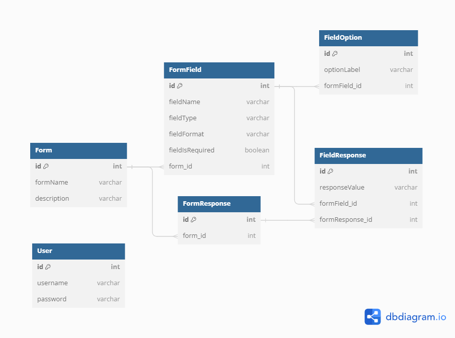

# Rpottier Form

Custom Form Builder and Response Viewer
This project is a web application built with Next.js and Nest.js, designed to provide a user-friendly solution for creating customized forms. Users can effortlessly design their own forms to gather specific data, and the platform allows them to both respond to these forms and view responses. Additionally, the application provides the capability to modify existing forms, providing flexibility and control in data collection processes.

Key Features
- Form Creation: Build personalized forms tailored to your data collection needs. Customize form fields, types, and styles.

- Form Responses: Users can submit responses to the created forms, providing valuable data for analysis and decision-making.

- Response Viewer: Effortlessly review and analyze form responses in a structured manner, helping you make informed decisions.

- Form Editing: Modify and update existing forms to adapt to changing requirements or improvements.

## Table of Contents

- [Prerequisites](#prerequisites)
- [Getting Started](#getting-started)
- [Configuration](#configuration)
- [Database](#database)
- [Usage](#usage)

## Prerequisites

Before you can run this project, make sure you have Docker installed on your system. Docker is a platform that allows you to run applications in containers, making it easy to manage dependencies and isolate environments.

### Installing Docker

#### Windows

If you are using Windows, you can install Docker Desktop by following the instructions available on the official Docker website:

[Install Docker Desktop on Windows](https://docs.docker.com/desktop/install/windows-install/)

#### macOS

If you are using macOS, you can install Docker Desktop by following the instructions available on the official Docker website:

[Install Docker Desktop on macOS](https://docs.docker.com/desktop/install/mac-install/)

#### Linux

For Linux users, the installation steps for Docker vary depending on the distribution. You can refer to the official Docker documentation for distribution-specific installation instructions:

[Install Docker on Linux](https://docs.docker.com/engine/install/)

### Verifying the Installation

Once Docker is installed, you can check if the installation was successful by running the following command in your terminal:

```bash
docker --version
```

You should see the Docker version displayed on the screen, confirming that Docker is correctly installed on your system.

## Getting Started
Instructions on how to get a copy of this project up and running on your local machine.

**Configuration**
Explain any project-specific configurations that users need to set up. Include information on environment variables, configuration files, or any other settings that are required.

**Creating the .env File**
Before running the project, create a .env file at the root of the project with the following content. Copy and paste this .env file into both the backend/ and frontend/ folders.

Here is an example of a working .env file for quickly running the application:


```env

API_PORT='3001'
FRONTEND_PORT='8080'

API_URL=http://localhost:3001
FRONTEND_URL=http://localhost:8080

# NOTICE: If you change POSTGRES_HOST, make sure it has the same value as the name of the service
# representing the PostgreSQL container in your docker-compose.yml file, or adjust the service name
# in the docker-compose.yml file accordingly.

POSTGRES_HOST=postgres

POSTGRES_USER=postgres
POSTGRES_PASSWORD=D#9fGt$K@1qP
POSTGRES_DB=postgresdb

JWT_SECRET="S&5pRz@Y7LmW"
```
**Running the Project**

To start the project, make sure you are in the directory containing the docker-compose.yml file and run the following command:
docker compose up


```bash
docker compose up
```

Wait for the application to fully start.

## Database


1) **Form**:  
	Form represents a customizable form that users can create.

2) **FormField**:  
	FormField represents a field within a form.

3) **FieldOption**:  
	FieldOption represents options associated with a field, typically used for select-type fields (drop down list, checkbox…)

4) **FormResponse**:  
	FormResponse represents a user's response to a specific form.

5) **FieldResponse**:  
	FieldResponse represents a user's response to a specific field within a form.

## Usage
1) **Sign Up**:  
	Create an account on the application by registering. If you already have an account, simply log in.

2) **Creating Forms**:  
	Visit the "Forms Creator" page to begin designing your customized forms.

3) **Responding to Forms**:  
	Navigate to the "Submissions" section of the website to complete and submit forms.

4) **Viewing Responses**:  
	Access responses for all forms in one place.

5) **Modifying Forms**:  
	Modify and update your forms as needed to adapt to changing requirements or improvements.